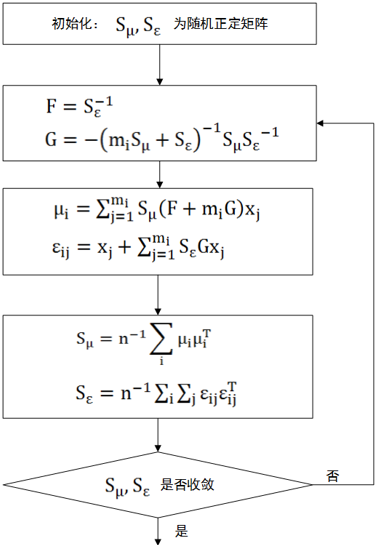

目录
====

[基于贝叶斯和神经网络方法的人脸验证 2](#_Toc8844656)

[问题背景： 2](#问题背景)

[Joint Bayesian Face 2](#joint-bayesian-face)

[Bayesian Face 2](#bayesian-face)

[Joint Formulation 3](#joint-formulation)

[参数学习 4](#参数学习)

[实验 4](#实验)

[神经网络模型 7](#神经网络模型)

[总结 7](#总结)

[Joint Bayesian Face 7](#joint-bayesian-face-1)

[神经网络 7](#神经网络)

[对比 7](#对比)

基于贝叶斯和神经网络方法的人脸验证

问题背景：
----------

近些年来，随着科学技术的快速发展，智能服务的需求也不断提高，在各个领域，生物特征识别技术都得到了非常广泛的应用，如在金融、司法以及打击恐怖主义等领域，生物特征识别技术都起到了至关重要的作用。

传统用于个人身份鉴别的主要技术手段包括ID卡(如身份证、工作证、智能卡、计算机标志卡和储蓄卡等)和密码等。这些技术方便、快捷，但易伪造、易窃取、安全防护能力有限。由于传统的身份验证方法存在诸多问题，已不能满足人们的需求。如何能既准确又快速的进行身份验证，成为人们更加关注的问题。

人脸识别是借助于人脸这一生物特征作为身份鉴别的标志。人脸识别技术相比于其他生物特征识别技术有以下几个特点：

>   1. 
>   安全性：人脸特征唯一、不易伪造、不可窃取。

>   2.
>   无侵犯性：人脸识别容易被使用者所接受，因为它不需要使用者和设备直接接触，而且操作隐蔽性较强，特别适合用于公共场所的安全监控等。

>   3.
>   成本低廉，易于安装：人脸识别系统的采集工作，一般只需用摄像头或摄像机即可完成，这些设备价格低廉，易于安装。

>   4.
>   无人工参与：用户可以预先设定识别系统，计算机便可以根据设置自动进行采集、检测、识别等，整个过程无需被检测人的主动参与。

>   5.
>   便于事后追踪：人脸识别系统能够自动将采集到的人物存档，便于后续的事件追踪，

因此，人脸识别具有广泛的商业应用价值，在学术界和工业界都处于火热研究的状态。其中，人脸验证（face
verification）和人脸识别（face identification）又是人脸识别（face
recognition）的两个重要的方向。人脸验证主要任务为给定两张图片，对此进行判断是否为同一个人。我们将对其中的人脸验证方向进行实验研究的探索。

Joint Bayesian Face
-------------------

Joint Bayesian Face 方法是基于Bayesian Face
的一种改进，主要的差别在于：经典的贝叶斯人脸识别方法是对两张人脸的差异进行建模，而Joint
Bayesian Face 是将两个人脸进行联合建模。

### Bayesian Face

假设两张人脸图像特征表示分别为${{x}_{1}}$和${{x}_{2}}$，${{H}_{I}}$表示两张人脸图片为同一个人，${{H}_{D}}$则不为同一个人。人脸验证的问题转变为根据特征差别$\Delta
={{x}_{1}}-{{x}_{2}}$进行分类的问题，判断$P({{H}_{I}}\|\Delta
)=\frac{P(\Delta \|{{H}_{I}})P({{H}_{I}})}{P(\Delta )}$
和$P({{H}_{E}}\|\Delta )=\frac{P(\Delta \|{{H}_{E}})P({{H}_{E}})}{P(\Delta
)}$
的大小，进行比较。根据MAP最大先验概率，似然比可以表示为：$r({{x}_{1}},{{x}_{2}})=\log
\frac{P(\Delta \|{{H}_{I}})}{P(\Delta \|{{H}_{E}})}$ 。

但是，若人脸特征分布如上图所示，则投影相交的部分则无法有效的进行区分。针对此，Joint
Bayesian Face 在此进行改进。

### Joint Formulation

和经典Bayesian Face 不同的是，Join Bayesian Face
选择对${{x}_{1}}$和${{x}_{2}}$进行联合建模，即为考虑$\{{{x}_{1}},{{x}_{2}}\}$的联合分布。则此时$r({{x}_{1}},{{x}_{2}})=\log
\frac{P({{x}_{1}},{{x}_{2}}\|{{H}_{I}})}{P({{x}_{1}},{{x}_{2}}\|{{H}_{E}})}$。此外，还进行假设$P({{x}_{1}},{{x}_{2}}\|{{H}_{I}}),P({{x}_{1}},{{x}_{2}}\|{{H}_{E}})$都服从高斯分布：

$\begin{align}
& P({{x}_{1}},{{x}_{2}}\|{{H}_{I}})=N(0,{{\Sigma }_{I}}) \\
& P({{x}_{1}},{{x}_{2}}\|{{H}_{E}})=N(0,{{\Sigma }_{E}}) \\
\end{align}$

并引入先验知识：不同的人在特征空间上处于不同的位置。由于不同的角度、光照、表情等影响，同一个人在特征空间上并不是一个点，而是在一个位置的多个点组成。这样就可以把人脸这一随机变量变成两个独立随机变量的和，$x=\mu
+\varepsilon $，其中$\mu $表示身份；$\varepsilon
$表示同一个人脸的不同的变化差异（角度、光照、表情等），且$\mu
=N(0,{{S}_{\mu }})$，$\varepsilon =N(0,{{S}_{\varepsilon }})$。

由以上假设，则可推出 $\{{{x}_{1}},{{x}_{2}}\}$也是0均值的高斯分布。且有：

${{\Sigma }_{I}}=\left[ \begin{matrix}
{{S}_{\mu }}+{{S}_{\varepsilon }} & {{S}_{\mu }} \\
{{S}_{\mu }} & {{S}_{\mu }}+{{S}_{\varepsilon }} \\
\end{matrix} \right]$，${{\Sigma }_{E}}=\left[ \begin{matrix}
{{S}_{\mu }}+{{S}_{\varepsilon }} & 0 \\
0 & {{S}_{\mu }}+{{S}_{\varepsilon }} \\
\end{matrix} \right]$

此时，似然比可以推得：$r({{x}_{1}},{{x}_{2}})=\log
\frac{P({{x}_{1}},{{x}_{2}}\|{{H}_{I}})}{P({{x}_{1}},{{x}_{2}}\|{{H}_{E}})}=x_{1}\^{T}A{{x}_{1}}+x_{2}\^{T}A{{x}_{2}}-2x_{1}\^{T}G{{x}_{2}}$，其中$A={{({{S}_{\mu
}}+{{S}_{\varepsilon }})}\^{-1}}-(F+G)$ ，$\left[ \begin{matrix}
F+G & F \\
G & F+G \\
\end{matrix} \right]={{\left[ \begin{matrix}
{{S}_{\mu }}+{{S}_{\varepsilon }} & {{S}_{\mu }} \\
{{S}_{\mu }} & {{S}_{\mu }}+{{S}_{\varepsilon }} \\
\end{matrix} \right]}\^{\text{-1}}}$ ，因此只要模型估计得到${{S}_{\mu}},{{S}_{\varepsilon }}$ 便可求得$r({{x}_{1}},{{x}_{2}})$，做出分类判断。
### 参数学习
模型通过EM-like算法进行${{S}_{\mu }},{{S}_{\varepsilon}}$的求解，分为E步和M步：
>   E步：已知${{S}_{\mu }},{{S}_{\varepsilon }}$求$\mu ,\varepsilon
>   $：$\mu \text{=}\sum\limits_{i=1}\^{m}{{{S}_{\mu
>   }}(F+mG){{x}_{i}}},{{\varepsilon
>   }_{j}}={{x}_{j}}+\sum\limits_{i=1}\^{m}{{{S}_{\varepsilon
>   }}G{{x}_{j}}}$

>   M步：根据$\mu ,\varepsilon $，更新${{S}_{\mu }},{{S}_{\varepsilon
>   }}$：${{S}_{\mu }}\text{=}\operatorname{cov}(\mu
>   ),{{S}_{\varepsilon }}=\operatorname{cov}(\varepsilon )$

### 实验

**1 数据集：**

1.1 测试集：Label Face in the Wild (LFW) 数据集

LFW数据集是由马萨诸塞大学于2007年建立，用于评测非约束条件下的人脸识别算法性能，是人脸识别领域使用最广泛的评测集合。该数据集由13000多张全世界知名人士互联网自然场景不同朝向、表情和光照环境人脸图片组成，共有5749个人，其中只有95人拥有超过15幅图图片；有1680人有2张或2张以上人脸图片；其他4069个人，只有一张图片。每张人脸图片都有其唯一的姓名ID和序号加以区分。

该数据库从中随机选择了6000对人脸组成了人脸辨识图片对，其中3000对属于同一个人2张人脸照片，3000对属于不同的人每人1张人脸照片。测试过程LFW给出一对照片，询问测试中的系统两张照片是不是同一个人，系统给出“是”或“否”的答案。通过6000对人脸测试结果的系统答案与真实答案的比值可以得到人脸识别准确率。LFW测试正确率，代表了人脸识别算法在处理不同种族、光线、角度、遮挡等情况下识别人脸的综合能力。

1.2 训练集：a new dataset, WDRef

通过在图像搜索引擎中查询一组人名收集图片和标注人脸，并且收集的人名和LFW中的没有重叠。然后，通过人脸检测进行校正。最终数据集包含2995人的71846张图片，其中2065个人超过15张，1000多个人多于40个图片。

**2 数据处理：**

LBP局部二值特征：人脸特征提取使用LBP局部二值模式特征作为模型特征输入，通过LBP特征提取后数据维度如下：训练集：(71846,
5900)；测试集：(13233, 5900) 。

PCA降维：由于特征维度较高，使用PCA 进行特征降维，降维5900维至2000维。

**3 结果：**

最后通过EM算法进行模型参数学习，再迭代130步左右后，模型收敛。在测试集给出3000对相同人脸和3000对不同人脸上进行测试，结果如下：

模型优点：模型简单，收敛速度快，同时还能保证较不错的准确率，相比经典贝叶斯方法，对特征联合分布建模，使得模型具有更好的区分能力

模型缺点：相比如今流行的神经网络模型，准确率依然无法媲美。

| Accuracy | Precision | Recall | F1 score |
|----------|-----------|--------|----------|
| 0.893    | 0.908     | 0.875  | 0.891    |

神经网络模型
------------

总结
----

### Joint Bayesian Face

模型创新点在于将两个人脸表示进行联合建模。在人脸联合建模的时候，又使用了人脸的先验知识，将两张人脸的建模问题变为单张人脸图片的统计计算。

对经典的贝叶斯人脸识别方法进行了重新研究，提出了在相同概率框架下的联合公式。综合评价的优越性表明，传统的贝叶斯人脸识别在低阶特征和中等规模的训练数据下仍然具有很强的竞争力。

### 神经网络

### 对比

deepid:

<https://blog.csdn.net/stdcoutzyx/article/details/42091205>

bayes

https://blog.csdn.net/tinyzhao/article/details/53015724

<https://blog.csdn.net/hqbupt/article/details/37758627>

<https://blog.csdn.net/cyh_24/article/details/49059475>

<https://wenku.baidu.com/view/851d51e3647d27284a735164.html?re=view>
